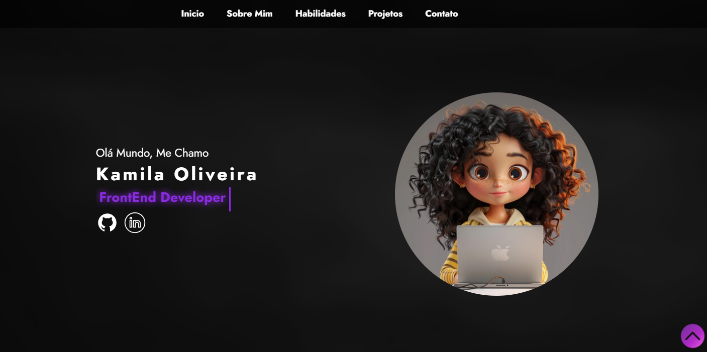

<h1>🚀 Meu portfólio</h1>
🔖  Sobre

Nesse Projeto eu resolvi desenvolver um portfólio para mim, já que eu estava sem nennhum. essa é a primeira versão dele, então tem muita coisa a melhorar mas só de ter feito ele dessa maneira, eu me sinto orgulhoso pois não imaginava que eu poderia chegar tão longe, mas cheguei

##  ✨Tecnologias utilizadas

O projeto foi desenvolvido utilizando as seguintes tecnologias

- HTML
- CSS
- Javascript

📄 Licença

Feito com 💜 por Kamila Oliveira 😊

 

